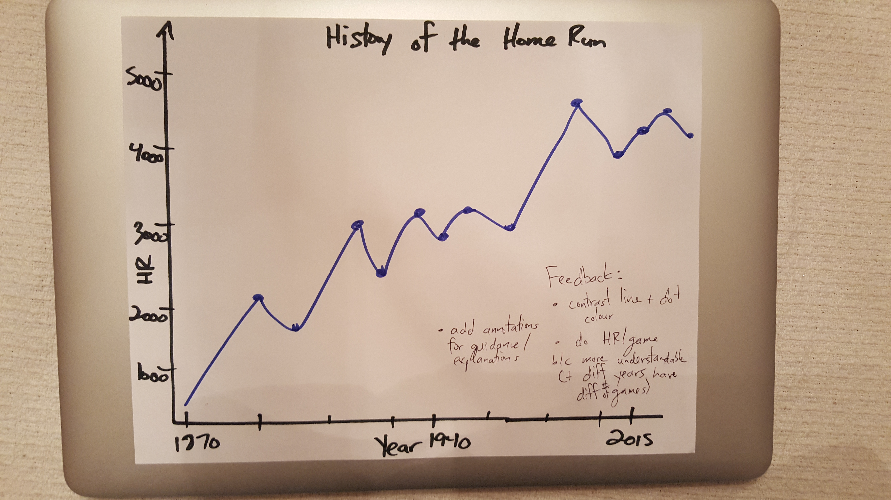

## P6: Make Effective Data Visualization
Create a data visualization from a data set that tells a story or highlights trends or patterns in the data. Use either dimple.js or d3.js to create the visualization. Your work should be a reflection of the theory and practice of data visualization, such as visual encodings, design principles, and effective communication.

### Summary
Hitting the ball over the fence is the ultimate manifestation of a hitter's power in baseball. As baseballs, bats, and the bodies of players themselves have evolved over the past 150 years, the amount of home runs per game has trended upwards. Since the number games per season has changed as well, home runs per game is plotted rather than home runs per season.

### Design
A connected scatter plot (with interactive tooltip via hover) was chosen as the final chart type. The connected line conveys the inherent relationship between successive time-series data points. The data point helps emphasize each year's home runs per game value.

Grey-blue was chosen for the connected line and red was chosen for the circles for contrast purposes. These colour choices were made after receiving feedback that more contrast would help readers pick out the data points from the connected line.

The annotations with pictures are included to guide the reader and help explain the large trends in the data. These were added because of reader feedback as well.

### Feedback

### Resources
http://www.baseball-reference.com/leagues/MLB/bat.shtml
http://bleacherreport.com/articles/1676509-the-evolution-of-the-baseball-from-the-dead-ball-era-through-today
http://jsfiddle.net/am8ZB/